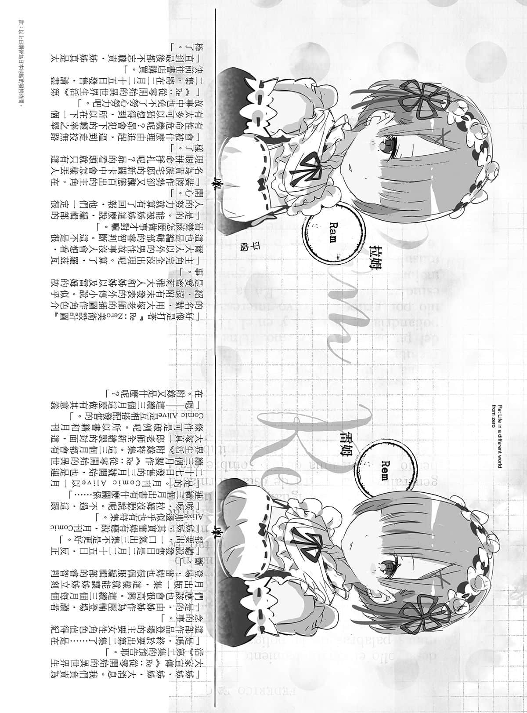

&emsp;&emsp;从实体书开始看的读者们，初次见面，我叫长月达平。

&emsp;&emsp;从网络文就在追的读者们大家好，我是鼠色猫。

&emsp;&emsp;从哪边认识的这点先搁置一旁，首先要感谢你们拿起这本书阅读。

&emsp;&emsp;因为也有在想「什么跟什么」的读者，所以我先说明一下。

&emsp;&emsp;本作品《Re：从零开始的异世界生活》原本是在网站「成为小说家吧」连载的作品，后来修改成实体书出版。

&emsp;&emsp;基本流程大致是沿用网络投稿版本，将语句修得更易读，并增加事件，把女主角描写得更可爱，让男主角更加倒霉被欺负，就成了各位现在看到的版本。

&emsp;&emsp;我想不管是知不知道网络版的人，都会为以封面为首的多张美丽插图喝采，不过要说喊最大声的人就是作者我本人啦。銀发女主角最棒！

&emsp;&emsp;画出被折磨凌虐的男主角以及可爱女主角的，是大冢真一郎老师。大冢老师用满到溢出来的设计力，描绘出连在作者脑内都没有具体形象的登场角色时，故事中的人物才叫真正诞生。

&emsp;&emsp;也就是说我是妈妈，大冢老师是爸爸，共同创造出他们。

&emsp;&emsp;第一次合作的事业今后也会持续下去，还望仰赖各位的帮助。

&emsp;&emsp;我就在这直接说了，在店内站着看的人请买下本书。因为还会继续出续集，所以请务必要买（笑）。

&emsp;&emsp;好啦，都有露骨直接的广告文了，就来稍微接触作品内容吧。

&emsp;&emsp;本作故事背景是奇幻异世界，也就是被归在「异世界之旅」这类出过无数名作的庞大体裁中。

&emsp;&emsp;剑与魔法的奇幻世界，是所有男孩以及一部分女孩的憧憬。本作品的主人翁也是一名平凡如斯的日本男儿。

&emsp;&emsp;不会用剑也不会魔法，若是不努力运用智慧连体力都输人。

&emsp;&emsp;在到处碰壁、走投无路的情况下，用不轻言放弃作为武器的主角，谱出锲而不舍的故事。

&emsp;&emsp;如果不死心能当作武器，那要怎么描写呢——本作是其中一个答案。

&emsp;&emsp;主角不断挣扎、焦虑，努力不懈能抓住什么？我说什么也想让大家看看那个答案，而且很想高声呐喊銀发女主角最棒了。

&emsp;&emsp;因为作者的嗜好整个跑出来，所以就用道谢来转换心情。

&emsp;&emsp;首先是将这部作品从网络小说界挖出来，用「出书试试看」的动人说词邀请我的责任编辑池本先生。我对池本先生真的是感激涕零。

&emsp;&emsp;两个大人在炸猪排店互相在对方的高丽菜上倒酱汁，同时用「要不要在女主角的名字后加个「酱（ちゃん）」字互相牵制。吵这个是要干嘛，但那样的激辩在出书的喜悦面前成了美好的回忆，谢谢您。

&emsp;&emsp;还有在忙碌的行程中，以惊人速度完成插图的大冢老师，每完成一张插图都苦恼到脚抽筋。

&emsp;&emsp;今后出场人物还会增加，敬请期待。多谢大家的支持。

&emsp;&emsp;还要向编辑部的各位、校对人员，与营销相关的所有人致上谢意。

&emsp;&emsp;这个故事能像这样化为形体，都是多亏了许多人竭力而为。

&emsp;&emsp;今后我会尽量努力，期许未来也能永远合作。

&emsp;&emsp;那么，后记真的来到最后了。拿起本书的先生小姐，还有在「成为小说家吧」就支持本作品的读者们，真的非常感谢。

&emsp;&emsp;期待能在下一集《Re：从零开始的异世界生活２》再相见！

&emsp;&emsp;2013年11月 长月达平

