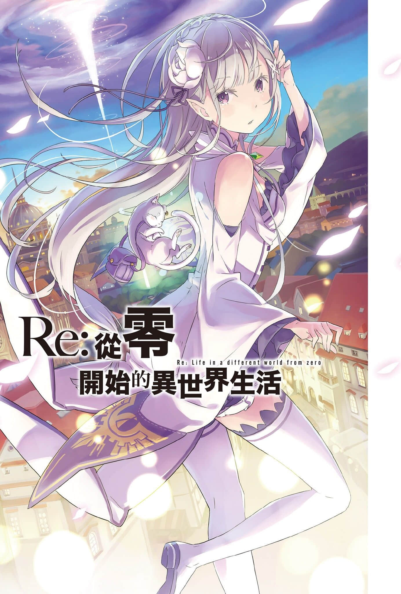
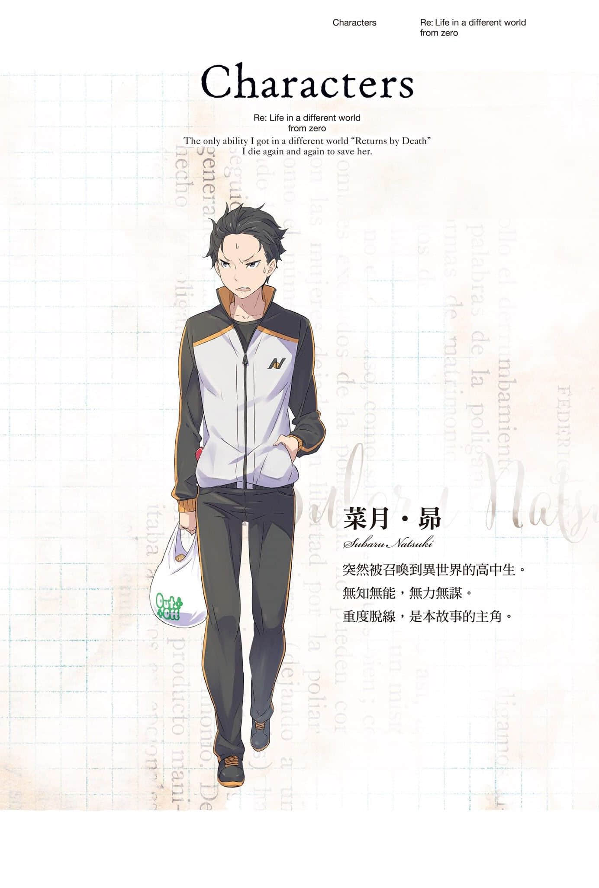
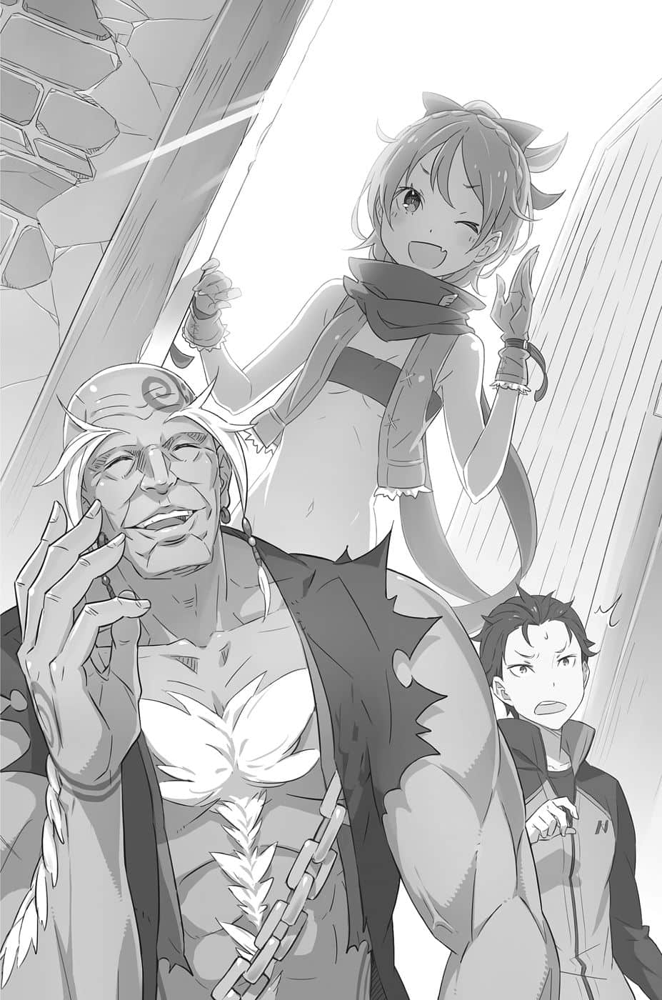

# 插图

---

&emsp;&emsp;台版 转自 轻之国度

&emsp;&emsp;作者：长月达平

&emsp;&emsp;插画：大冢真一郎

&emsp;&emsp;译者：黄盈琪

&emsp;&emsp;扫图：xfw95

&emsp;&emsp;录入：xfw95

&emsp;&emsp;校对：饺子欣露子

&emsp;&emsp;轻之国度：www.lightnovel.us

&emsp;&emsp;仅供个人学习交流使用，禁作商业用途

&emsp;&emsp;下载后请在24小时内删除，LK不负担任何责任

&emsp;&emsp;请尊重翻译、扫图、录入、校对的辛勤劳动，转载请保留信息

——————————————

### 内容简介

&emsp;&emsp;走出便利商店要回家的高中生・菜月昴突然被召唤到异世界。这莫非就是很流行的异世界召唤！？可是眼前没有召唤者就算了，还遭遇强盗迅速面临性命危机。这时，一名神秘銀发美少女和猫精灵拯救了一筹莫展的他。以报恩为名义，昴自告奋勇要帮助少女找东西。然而，好不容易才掌握到线索，昴和少女却被不明人士攻击而殒命——本来应该是这样，但回过神来，昴却发现自己置身在第一次被召唤到这个异世界时的所在位置。「死亡回归」——无力的少年得到的唯一能力，是死后时间会倒转回到一开始。跨越无数绝望，从死亡的命运中拯救少女！

&emsp;&emsp;大受欢迎的网络小说，在众所期待下成为实体小说！——即使你忘记了，我也不会忘记你。

