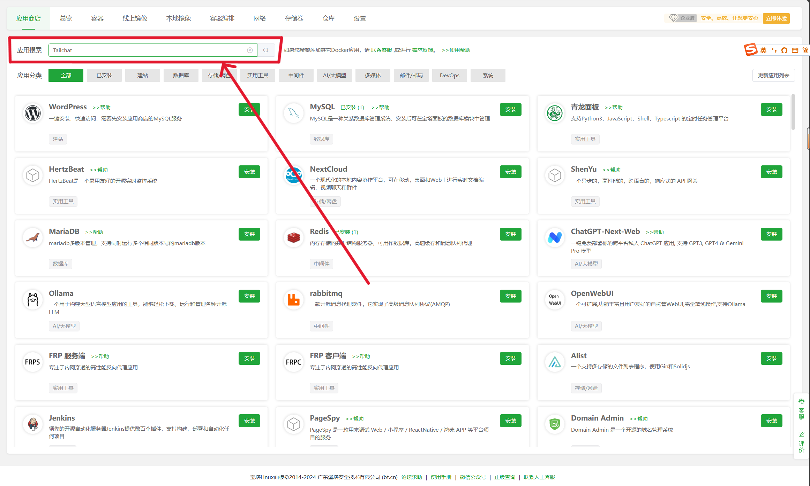
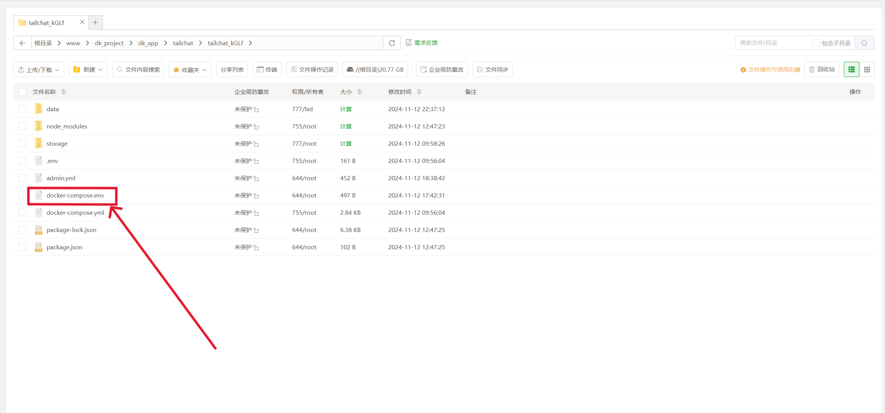

&emsp;&emsp;该文章将介绍如何在宝塔面板中 `Docker` 环境安装 `Tailchat`.

&emsp;&emsp;首先, `Tailchat` 是一款插件化易拓展的开源 `IM` 应用。可拓展架构赋予 `Tailchat` 无限可能性。

&emsp;&emsp;前端微内核架构 + 后端微服务架构 使得 `Tailchat` 能够驾驭任何定制化/私有化的场景

&emsp;&emsp;面向企业与私域用户打造，高度自由的群组管理与定制化的面板展示可以让私域主能够更好的展示自己的作品，管理用户，打造自己的品牌与圈子。

---
## 前面工作
:::tip 前提
- 一台安装有`Linux`的云服务器, `Linux` 版本的宝塔面板(已安装Docker), 域名(可选)

- 在 `Docker` 中已安装 `mongodb` `redis` `minio` `Tailchat CLI`, 已部署 `Docker Compose`.

- 相关内容还请参考 [Tailchat](https://tailchat.msgbyte.com/zh-Hans/docs/deployment/docker-compose) 的官方文档.
:::

## 开始
:::steps 
1. 进入到宝塔面板后, 在左侧侧边栏找到 `Docker` 并单击. 如图(10-1)所示
    
    
   
2. 在顶部导航栏中找到 `应用商店` 并点击. 如图(10-2)所示
    
    
3. 在 `应用搜索` 中搜索 `Tailchat`, 找到 `Tailchat` 卡片后点击安装.如图(10-3-1/2)所示
    
    
    
    

4. 在弹出的界面中, 版本选择 `latest`; 域名可以先不填, 如要填写则填写您已购买并正确解析到该云服务器IP地址的域名; 若未填写域名, 则需要勾选 `允许外部访问` 该选项; `端口`默认为 `11000` 并在您所在的云服务器的管理中心的安全组添加规则开放该服务器的端口 `11000`.

    - 例如,  当已填写域名`chat.wenturc.com` 时, 可忽略 `允许外部访问` 该选项, 然后在云服务器管理中心开放端口 `11000`, 当安装完毕后, 则可以直接通过网址 `chat.wenturc.com` 进行访问 `Tailchat`.
    - 如果未填写域名, 则需勾选 `允许外部访问` 选项, 并填写 `端口` 为`11000`, 然后在云服务器管理中心开放端口 `11000`, 当安装完毕后, 则需要通过云服务器的公网IP+端口 `11000` 进行访问.

    其次`cpu核心数限制`和`内存限制`这两个选项一般都填写 `0`, 具体的数字可以根据服务器的情况调整.

    
    我是这么填的:

    

5. 点击安装, 首次安装大约需要 5-10 分钟. 安装完毕后, 就可以通过相应的网址访问啦!

:::

## 其他配置

### `SMTP` 邮箱服务配置

下面将介绍如何配置 `Tailchat` 上的 `SMTP` 邮箱服务, 此处的 `SMTP` 邮箱服务用于 **密码找回** 、 **邮件认证**.

因为仅需要单向的发送邮件而无需接受邮件，因此在 `Tailchat` 中仅使用简单邮件服务(SMTP).

在开始之前, 需要先了解 [环境变量](https://tailchat.msgbyte.com/zh-Hans/docs/deployment/environment) 的相关内容.

好的, 那我们开始吧. 

:::steps
1. 找到 `Tailchat` 安装目录, 并该安装目录下找到 `docker-compose.env` 文件, 进行编辑.
   
    

    

2. 找到 `#SMTP` 注释, 更改 `SMTP_SENDER=` `SMTP_URI=` 后的内容.
   
   一般格式为: 

   - `SMTP_SENDER=`：发送人信息, `xxx@example.com` 或 `"YourName" xxx@example.com`
   - `SMTP_URI=`： SMTP 邮件服务地址, 遵循国际通用 URI 格式: `<protocol>://<username>:<password>@<host>:<port>/<other-info>`
   
     例如, 我的邮箱是 `111111111@qq.com` , 已在QQ邮箱开通 `SMTP`邮箱服务, 并且 `SMTP`密钥为 `xxxxxxxxxx`.
     那么我该这样填写: 
     ```.env
     # SMTP
     SMTP_SENDER="\"发件人名字\" 111111111@qq.com"
     SMTP_URI="smtps://111111111@qq.com:xxxxxxxxxx@smtp.qq.com:465"
     ```
3. 写好 `SMTP_SENDER=` `SMTP_URI=` 后, 使用 `Tailchat-CLI` 辅助检查配置是否正确.
   具体步骤是:

   :::steps
   1. 在宝塔面板的侧边栏中找到 `终端`
   2. 在终端中输入以下指令:

    登录 `SMTP` 服务:

    ```bash
    tailchat smtp verify  Verify smtp sender service
    ```
    发送测试邮件:

    ```bash
    tailchat smtp test    Send test email with smtp service
    ```
    :::
4. 若上述都测试成功, 保存 `docker-compose.env` 后, 重启容器以应用配置, 这样就可以使用 `SMTP` 邮箱服务了.
:::

:::tip
你也可以在 [Tailchat](https://tailchat.msgbyte.com/zh-Hans/docs/deployment/smtp) 的官方文档上学习如何配置 `SMTP` 邮箱服务.
:::

